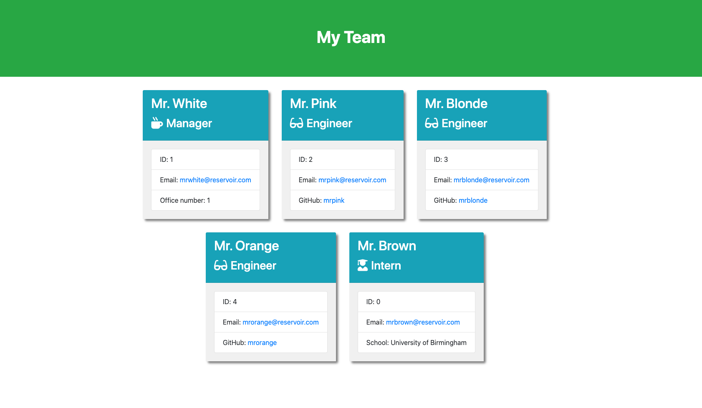

# Team Profile Generator

## Table of contents

- [Description](#description)
- [Installation](#installation)
- [Usage](#usage)
- [Contributing](#contributing)
- [Tests](#tests)
- [License](#license)
- [Deployed application](#deployed-application)
- [GitHub repository](#github-repository)
- [Questions](#questions)
- [Screenshot](#screenshot)
- [Demonstration Links](#demonstration-links)

## Description

I have been tasked to build a Node.js command-line application that takes in information about employees on a software engineering team, then generates an HTML webpage that displays summaries for each person.

## Installation

Step 1 -
Clone repository link into terminal
https://github.com/riz1ash786/team-profile-generator

Step 2 -
Open terminal and install inquirer using the following command `npm i inquirer`

Step 3 -
To test the application you will require jest which can be installed using the following command in terminal `npm i jest`.

Step 4 -
Enter `node index.js` in terminal to start the application.

## Usage

Complete the questions in terminal to successfully generate a new team HTML page.

## Contributing

There are no contributing guidelines at this moment in time. Please check back in the future.

## Tests

This application utilises jest and to test the app the following command `npm run test` should be used.

## License

  
License Name: MIT  
License Link: [MIT](https://opensource.org/licenses/MIT)

## Deployed Application

There is no URL of the deployed application on this occasion

## GitHub Repository

https://github.com/riz1ash786/team-profile-generator

## Questions

If you have any additional questions then please get in touch via github or email. Thank you.

- Github - https://github.com/riz1ash786
- Email address - riz1ash786@gmail.com

## Screenshot

## Demonstration Links

https://drive.google.com/file/d/1CACjaI0ldtUd12tCyW55wnLUxb6ftt4i/view?usp=sharing
